# jenkins-centos_dockerfile_and_intelligent_webserver_deployment
>**Requirements**:
* docker

* git

* github account
  
>**How to set up**:
* Download [Dockerfile](https://github.com/Icyshaman/jenkins-centos_dockerfile_and_intelligent_webserver_deployment/blob/master/Dockerfile). 
  * 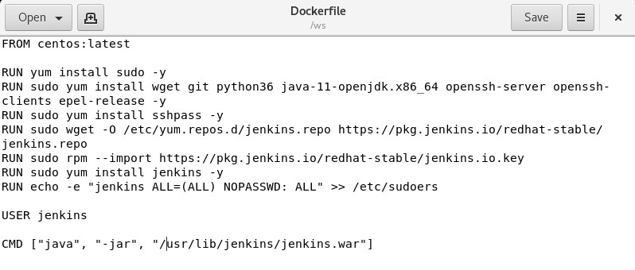
   

  [Dockerfile](https://github.com/Icyshaman/jenkins-centos_dockerfile_and_intelligent_webserver_deployment/blob/master/Dockerfile) will help in creation of docker image which will have jenkins pre installed in it and when we launch a container using that docker image it will automatically start Jenkins service.
  
* Build docker image using [Dockerfile](https://github.com/Icyshaman/jenkins-centos_dockerfile_and_intelligent_webserver_deployment/blob/master/Dockerfile).
  * 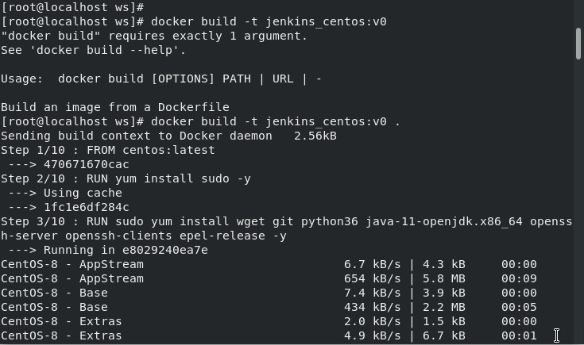
    
  * 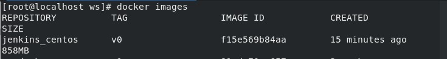
   

  Using terminal navigate to the folder where [Dockerfile](https://github.com/Icyshaman/jenkins-centos_dockerfile_and_intelligent_webserver_deployment/blob/master/Dockerfile) is stored and run command **docker build -t \<name you want to assign to image>:\<version>**.
  
* Using created docker image launch a container.
  * 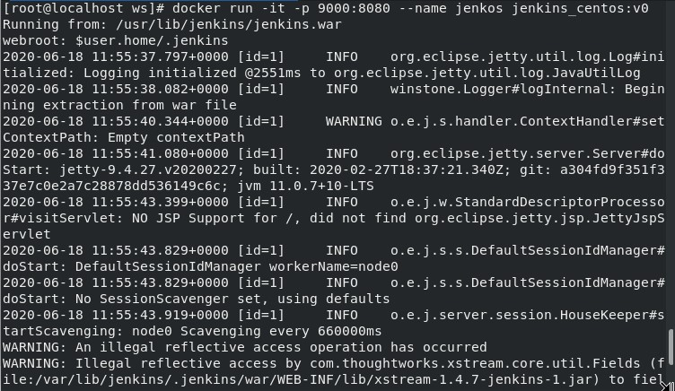
   

  Run command **docker run -dit -p \<port no. of host:port no. you want to expose> --name \<name of container> \<image name>:\<version>**.
  
* Navigate to **\<IP Address of host>:\<Port No. through which you expose jenkin service running inside container>** using web browser.
  * 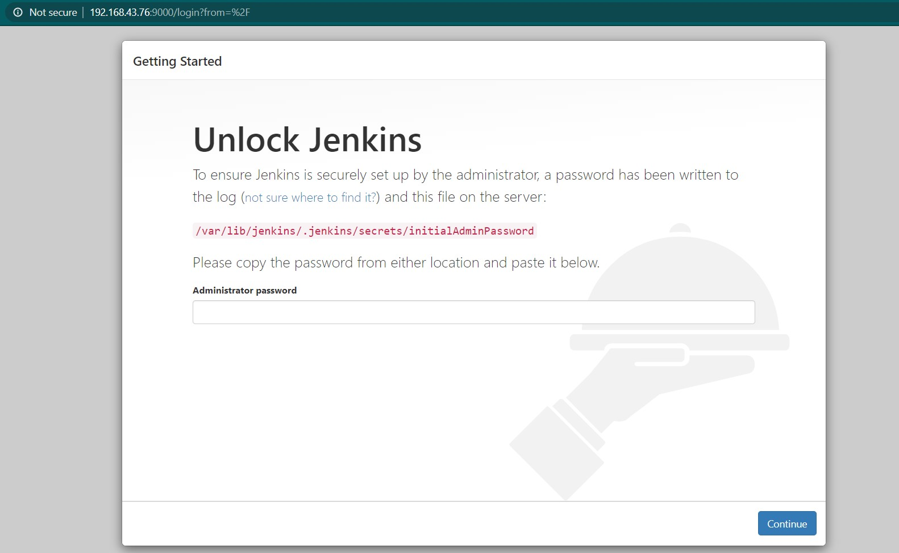
    
  * 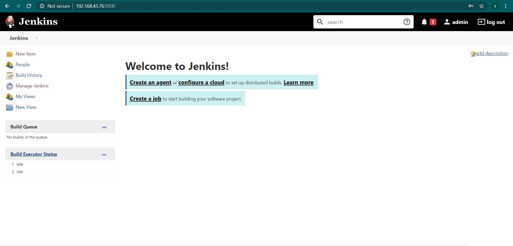
   

  Unlock jenkins using administrator password which you can find in terminal message received when you launched the container.
  
* Update password of Jenkins.
  
* Install Git and Email Extension plugins.
  
* Configure E-mail Notification.
  
* Clone github repository to your local system.
  
* Configure git hooks.
  * 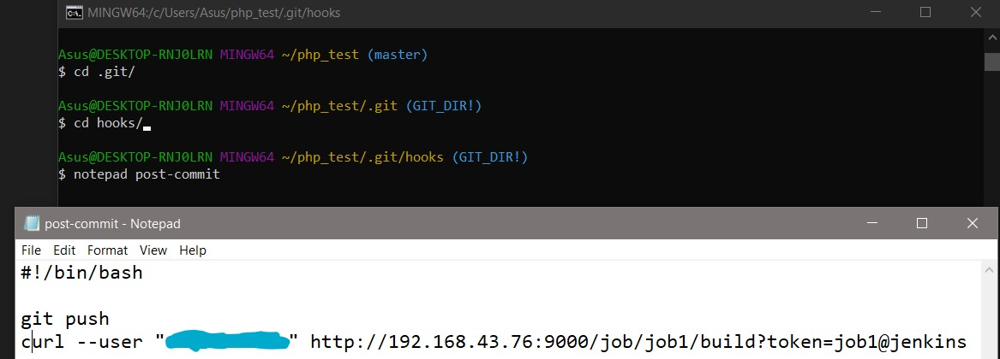
   

  It will push the repo to github, whenever developer run git commit command and trigger jenkins job1.
    
* Create Job1 and configure it.
  * 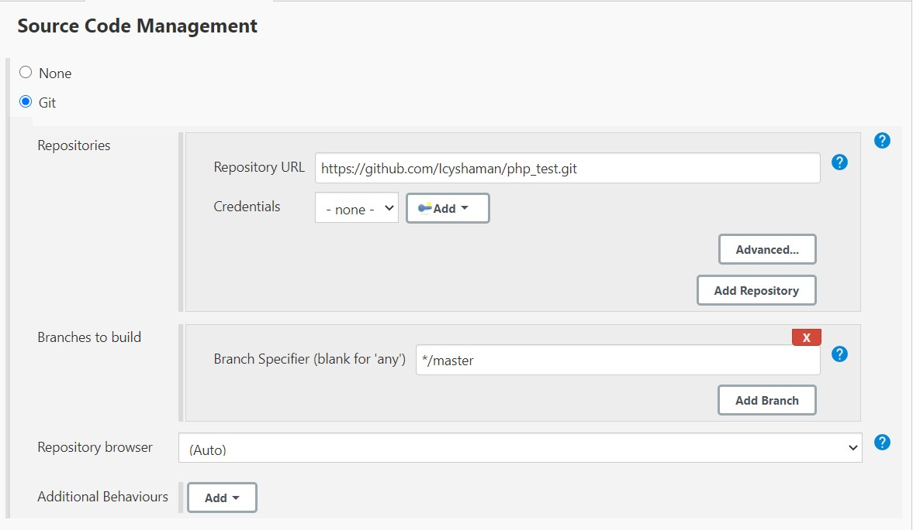
    
  * 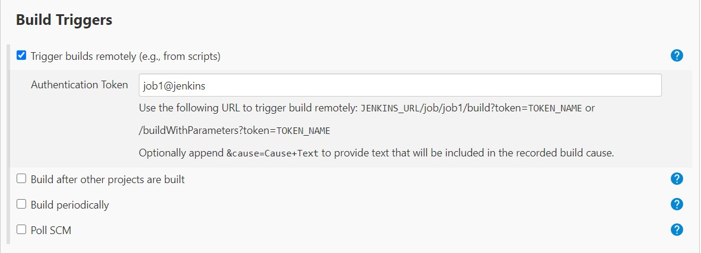
    
  * 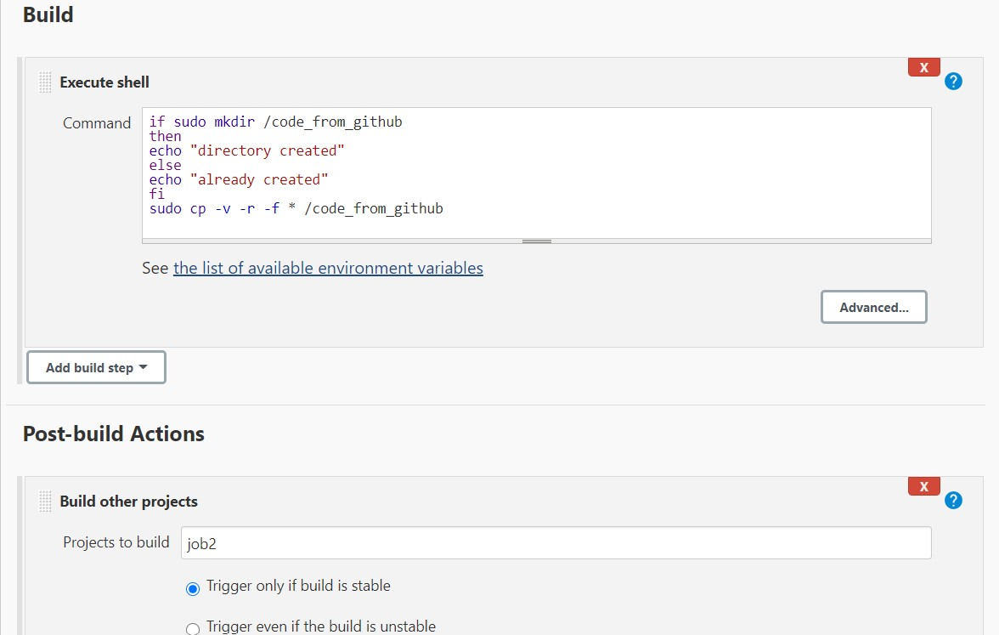
   

  Job 1 will download the repo locally to the container when developer push repo to github and trigger job2 once job1 executed successfully.
  
* Create Job2 and configure it.
  * 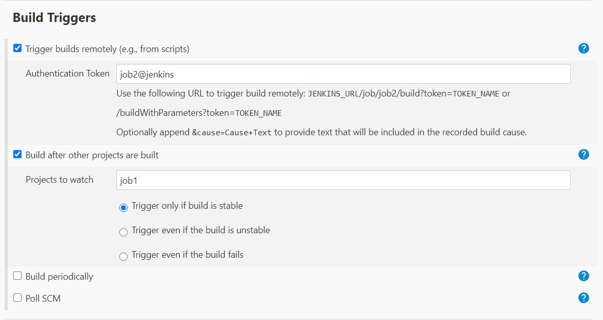
    
  * 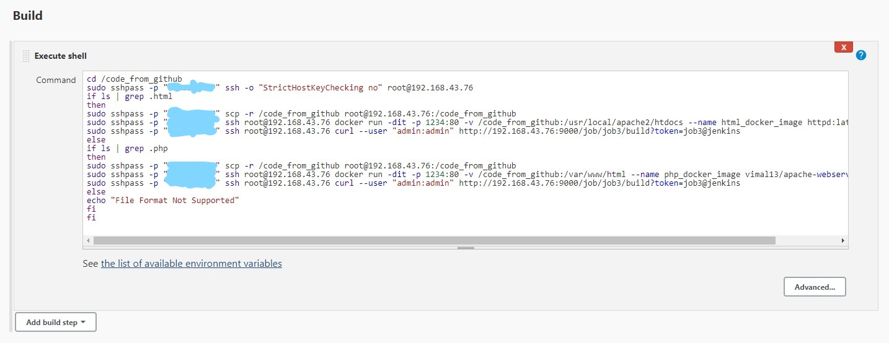
   

  Job2 will analyze the code and check whether it is php code or html code, and based on the result it will launch an appropriate container for the code and trigger job3.
  
* Create Job3 and configure it.
  * 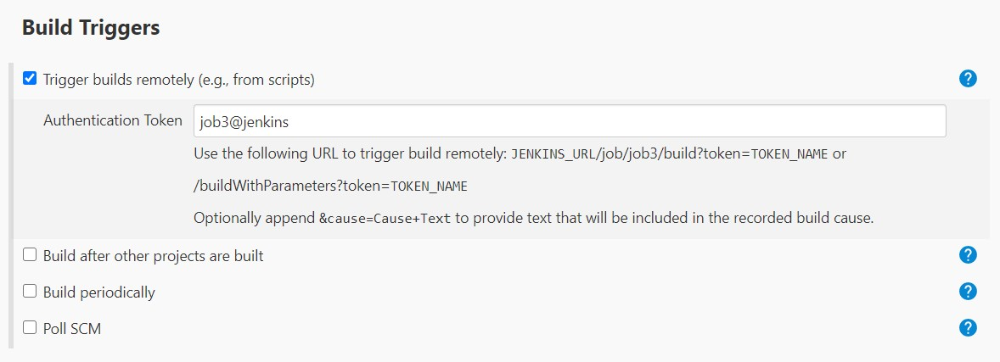
    
  * 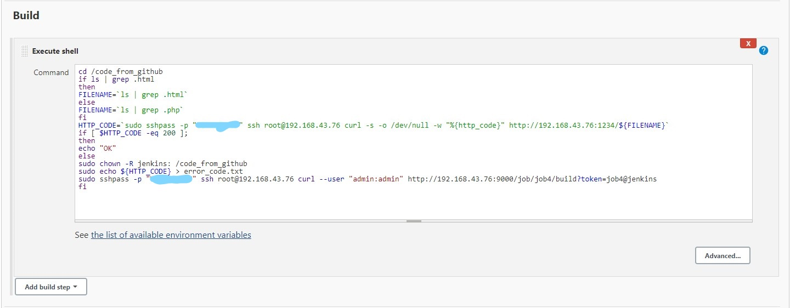
   

  Job3 will test whether set up is working or not and if set is not working then trigger job4.
  
* Create Job4 and configure it. 
  * 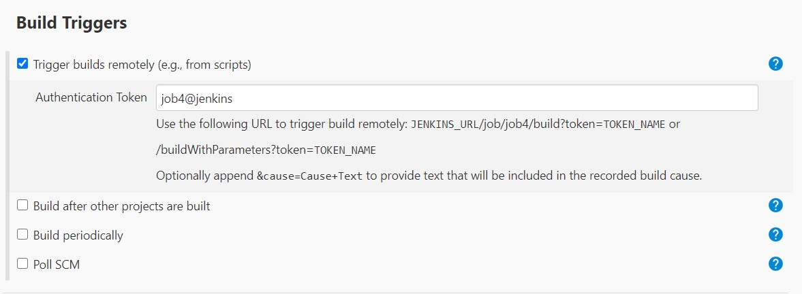
    
  * 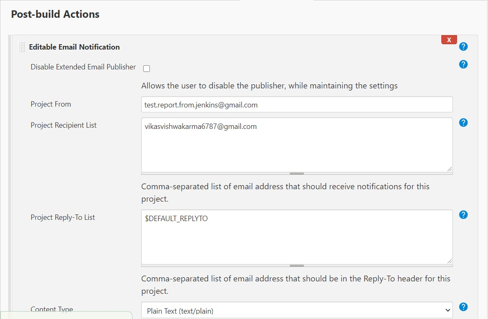
    
  * 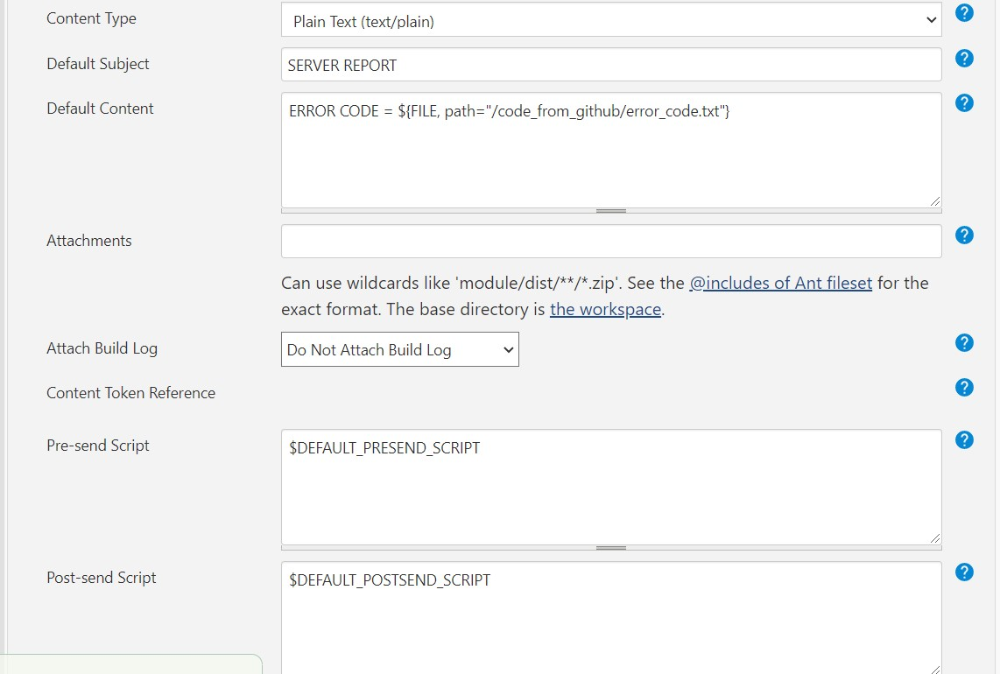
    
  * 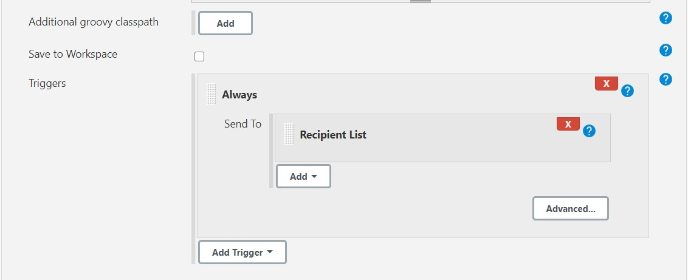
   

  Job4 will send an email to developer with error code.
  
* Create Job5 and configure it.
  * 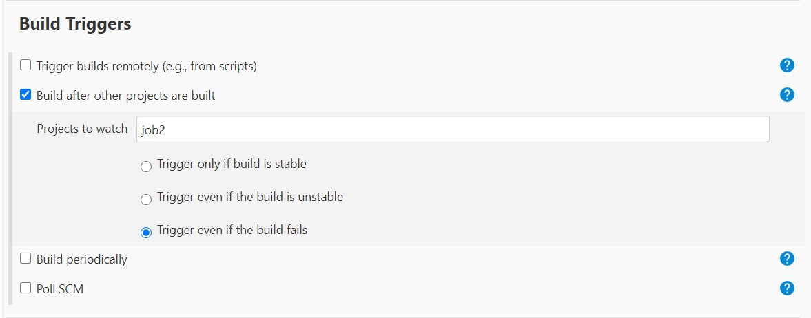
    
  * 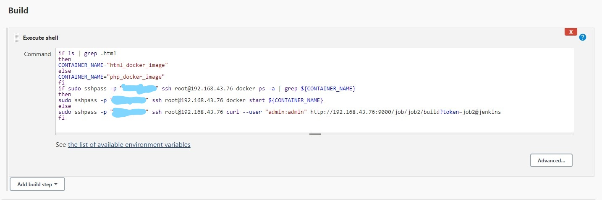
   

  Job5 will check whether the container in which webserver is being deployed is running or not and if not then it will try to start it.
  
>**How to access web page**:
* Navigate to **http://\<IP Address of host>:1234/\<Name of web page>** using web browser.
  * 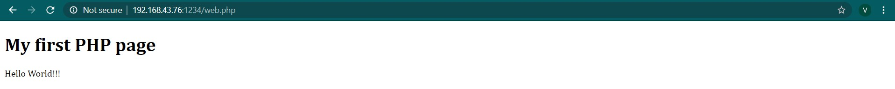