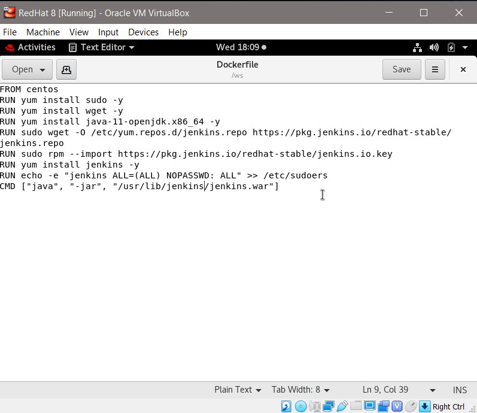
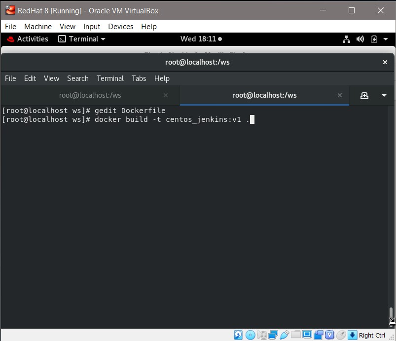
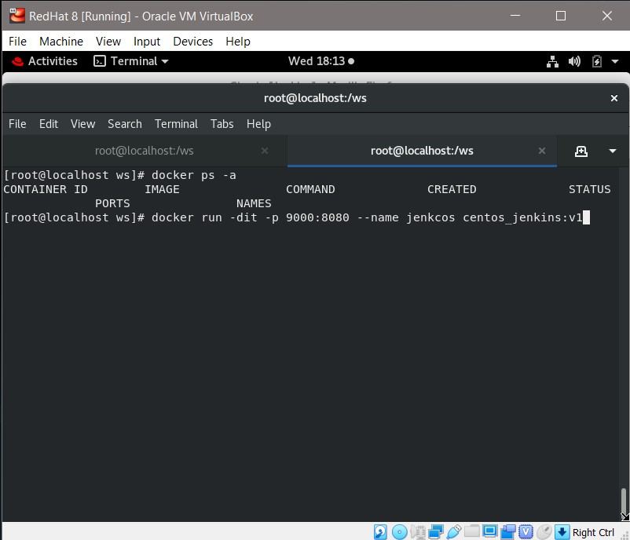
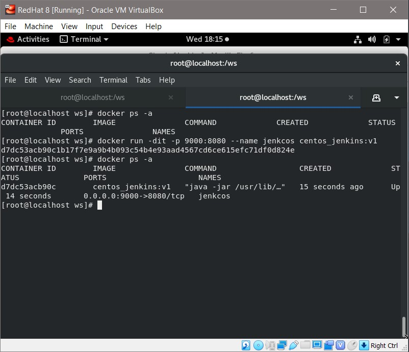
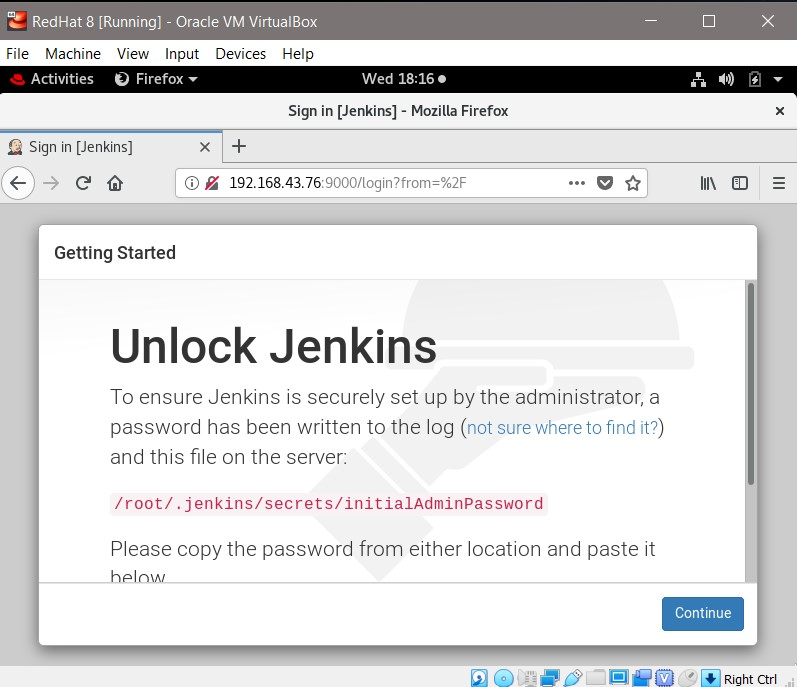

# centos_jenkins_dockerfile
>**Steps**:
* create a file named **Dockerfile** with following script
  
  
  
* run command **docker build -t < name you want to assign to image >:< version >**.
  
  
  
* run command **docker run -dit -p < port no. of host:port no. you want to expose > --name < name of container > < image name >:< version >**.
  
  
  
* By performing above task we can start jenkins service on docker container.

  
  
  
